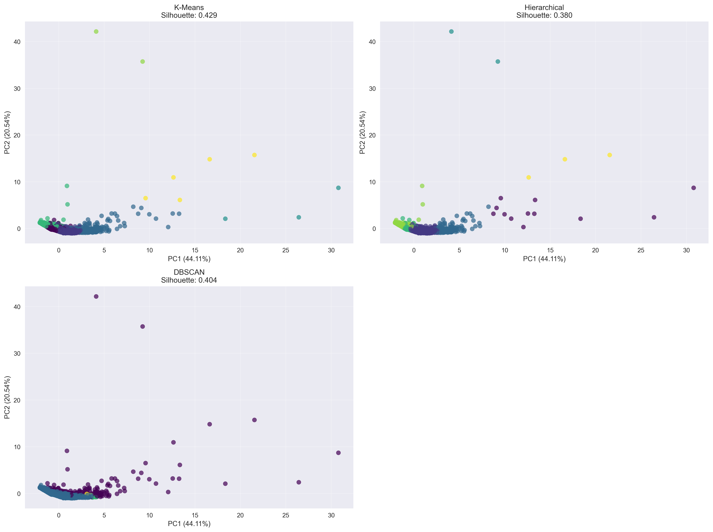
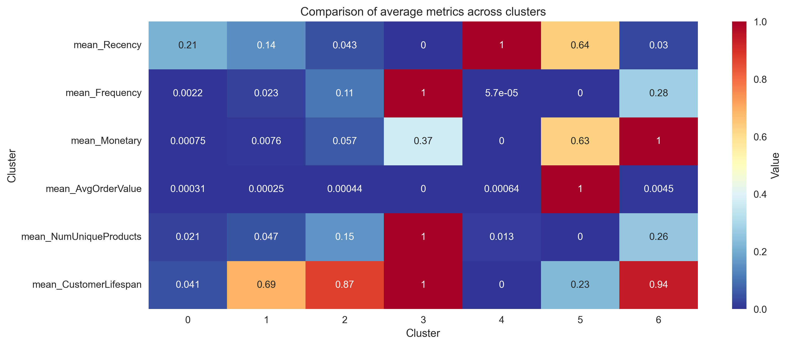
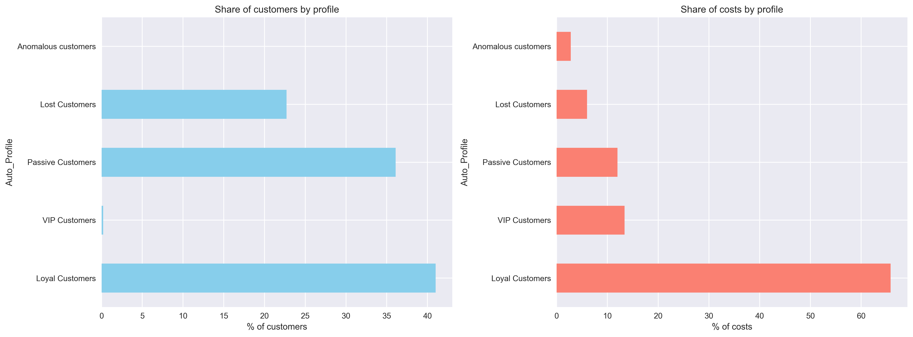

# 🧠 Customer Segmentation with RFM and Clustering / 🧠 Сегментація клієнтів на основі RFM і кластеризації

**📄 Опис проєкту (UA)**: Цей проєкт присвячений сегментації клієнтів за допомогою RFM-аналізу (давність, частота, сума покупок) та алгоритмів кластеризації без вчителя. Мета — виявити різні типи клієнтів на основі їхньої поведінки для формування персоналізованих маркетингових стратегій.


**📄 Project Description (EN)**: This project focuses on customer segmentation using RFM analysis (Recency, Frequency, Monetary value) and unsupervised clustering algorithms. The main goal is to identify distinct customer groups based on their purchasing behavior to help businesses tailor their marketing strategies.

## 📂 Project Structure

- `1_EDA_and_Cleaning.ipynb` — data exploration, cleaning, RFM and customer features engineering
- `2_Clustering_and_Evaluation.ipynb` — clustering with KMeans, Agglomerative, DBSCAN + evaluation
- `3_Business_Insights_and_Segments.ipynb` — segment profiling and business interpretation
- `data/` — raw and cleaned datasets
- `screenshots/` — project visuals
- `requirements.txt` — Python libraries

## 🔍 Техніки
- RFM-аналіз
- Генерація ознак: середній чек, тривалість життя клієнта
- Масштабування, PCA
- Кластеризація: KMeans, Agglomerative, DBSCAN
- Метрики якості: Silhouette, Calinski-Harabasz, Davies-Bouldin
- Бізнес-профілі: VIP, Lost, Passive, Loyal тощо


## 🔍 Techniques Used
- RFM segmentation
- Feature engineering (AvgOrderValue, CustomerLifespan, etc.)
- StandardScaler, PCA
- KMeans, Agglomerative, DBSCAN
- Silhouette, Calinski-Harabasz, Davies-Bouldin
- Profiling segments: VIP, Lost, Passive, Loyal, etc.

### 🖼️ Clusters PCA



### 🖼️ Segment heatmap



### 🖼️ Segment profiles




## 🧩 Dataset

- Kaggle: [Customer Segmentation Dataset](https://www.kaggle.com/datasets/yasserh/customer-segmentation-dataset)

### 🧪 How to run / Як запустити:
```bash
git clone https://github.com/IrynaSenchenko/Customer-Segmentation-RFM-Clustering.git
cd Customer-Segmentation-RFM-Clustering

pip install -r requirements.txt
```
Open and run the notebooks in order using Jupyter Notebook, JupyterLab, or VS Code:
notebooks/1_EDA_and_Cleaning.ipynb — load and clean the data, generate RFM features
notebooks/2_Clustering_and_Evaluation.ipynb — apply clustering algorithms and evaluate models
notebooks/3_Business_Insights_and_Segments.ipynb — analyze clusters and interpret business insights

---

👩‍💻 **Author:** Iryna Senchenko  
🔗 [LinkedIn profile](https://www.linkedin.com/in/iryna-senchenko/)